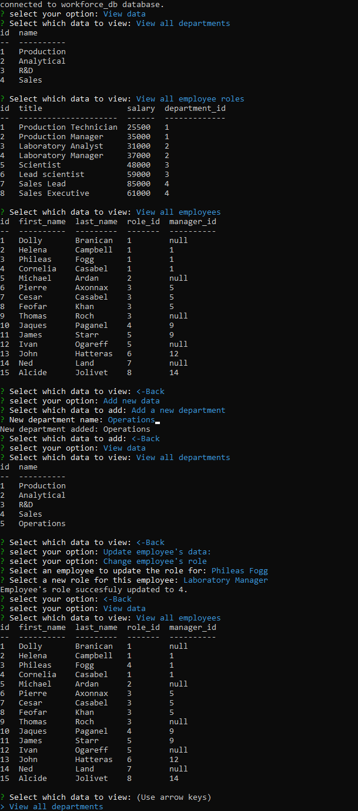

# Employee Tracker - SQL - edX bootcamp challenge 12.

## Description

a node.js application that uses inquirer prompts to operate a MYSQL database of employees, their roles within a company and company departments.

## Table of Contents

* [Product Demonstration](#product-demonstration)
* [Installation](#installation)
* [Usage](#usage)
* [Contributing](#contributing)
* [Tests](#tests)
* [Future Development](#future-development)
* [Questions](#questions)
* [License](#license)

## Product Demonstration

### Video Demonstration

[Employee-tracker-SQL-Video demo](https://drive.google.com/file/d/1uwqeJ8FDMIHwWkc-1MB1k8ZlWVtK6rn1/view?usp=sharing)

### Screenshot

## Installation

* Clone the repository, or download and extract the zip file:
    >[https://github.com/TP4458/Employee-Tracker-SQL-Tomasz-Pawlikowski.git](https://github.com/TP4458/Employee-Tracker-SQL-Tomasz-Pawlikowski.git)  
* Navigate to the folder containing the files using your CLI.
* Run npm install.
* Run node server.js.

This application comes pre-seeded with some example data.

## Usage

run node index.js command in the root directory of the application, select an option from the list of prompts, and answer prompted questions.

## Contributing

To contribule to this project you can contact me using the links found in [Questions](#questions) section.

## Tests

N/A

## Future Development

Features that remain to be added to the application:

* Delete entries to the database.
* Display salary costs for departments.
* Display more useful data such as "List all employees by department" etc.

## Questions

Any questions regarding this project can be directed to:
* Email: [TP4458@gmail.com](TP4458@gmail.com)
* GitHub: [TP4458](https://github.com/TP4458)

## License

This product is licensed with MIT License. Please click on the badge below, or at the top of this document to find out more.

 
